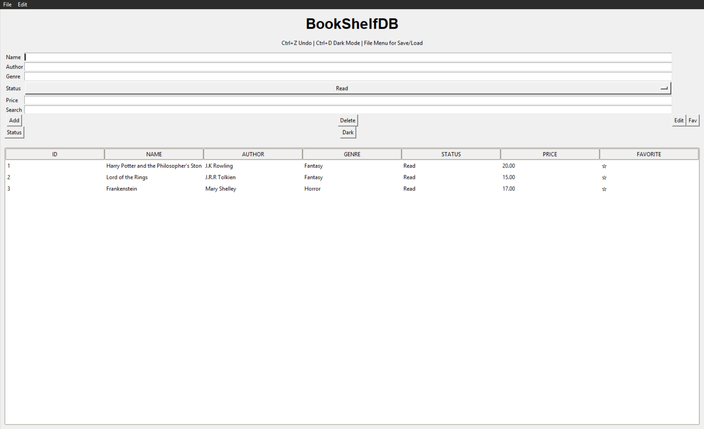
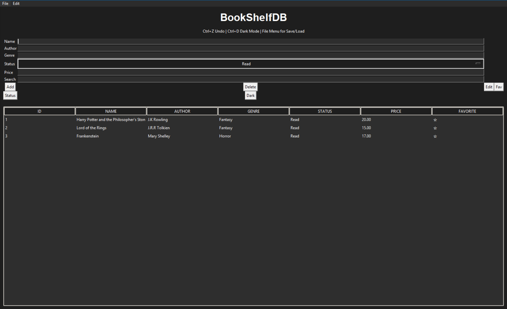

  
  BookShelfDB

## BookShelfDB

A simple desktop application to manage and track books using Python and SQLite.

  
  
  
  

## Download
Latest Release : https://github.com/laruellemarius/BookshelfDB/releases/tag/v1.0

## Screenshots

### Main interface

### Dark mode

BookShelfDB

A simple desktop application to manage and track books using Python and SQLite.

Features :
- Add, edit, and delete books
- Track reading status
- Favorite system
- Search and sort functionality
- Dark mode
- Export, backup, and restore database
- Undo actions

The application uses a local SQLite database file:

books.db

It is created automatically on first launch.

Run the executable to use the app.

Notes :
- All data is stored locally
- No internet connection required
- Lightweight
